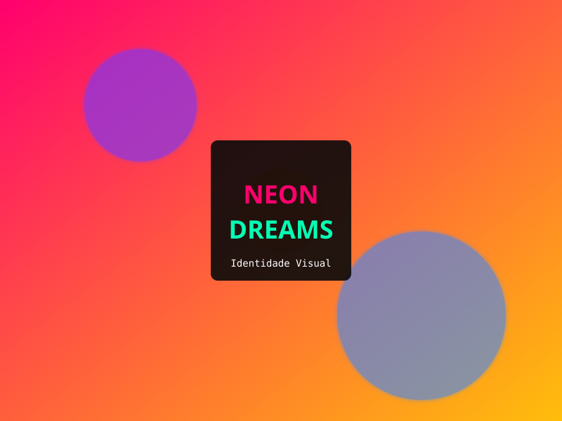

# 📁 Guia de Assets - Onde Colocar seus GIFs

## 🎯 Hover Effects nos Projetos

Os cards de projeto já estão configurados para trocar de imagem no hover. Para adicionar GIFs animados:

### Estrutura de Pastas

```
portfolio-creative/
├── assets/
│   ├── images/
│   │   └── (imagens estáticas já existem)
│   └── gifs/          ← CRIAR ESTA PASTA
│       ├── hackathon-hover.gif
│       ├── pipeline-hover.gif
│       ├── hospital-hover.gif
│       ├── vendas-hover.gif
│       ├── supremo-hover.gif
│       └── portfolio-hover.gif
```

### Como Adicionar

1. **Crie a pasta `gifs`** dentro de `assets/`
2. **Coloque seus GIFs** com os nomes sugeridos acima
3. **Atualize o `index.html`** - Troque os caminhos `data-animated`:

```html
<!-- ANTES (sem GIF) -->


<!-- DEPOIS (com GIF) -->

```

### Tipos de GIFs Sugeridos

| Card | Sugestão de GIF |
|------|-----------------|
| Hackathon | Terminal codando, deploy na cloud, logs rodando |
| Pipeline | Data flow, ETL process, gráficos animados |
| Hospital | Dashboard médico, gráficos de saúde pública |
| Vendas | Charts Python, pandas processando dados |
| SUPREMO | Java compiling, backend architecture |
| Portfolio | Code scrolling, HTML/CSS animado |

### Onde Encontrar/Criar GIFs

1. **ScreenToGif** (Windows) - Grava sua tela e converte para GIF
2. **LICEcap** (Windows/Mac) - Grava área específica da tela
3. **Giphy** - Buscar GIFs de tecnologia/coding
4. **Criar no After Effects/Premiere** - Exportar como GIF
5. **Terminalizer** - Gravar terminal e gerar GIF (para comandos/data)

### Dicas

- **Tamanho**: Mantenha abaixo de 2MB por GIF
- **Dimensões**: 800x600 ou 600x450 é ideal
- **Loop**: Configure para loop infinito
- **Paleta**: Use cores que combinem com o Cyber-Brutalista (verde neon, ciano)

### Alternativa: Vídeos MP4

Se preferir vídeos (mais leves que GIFs), substitua a tag `img` por `video`:

```html
<video autoplay loop muted playsinline>
    <source src="assets/videos/hackathon.mp4" type="video/mp4">
</video>
```

---

## 🎨 Imagens Estáticas (SVGs Atuais)

As imagens placeholder estão em `assets/images/`:
- `projeto1-static.svg` a `projeto6-static.svg`

Para substituir por suas próprias imagens (JPG/PNG):
1. Crie imagens em 800x600
2. Salve na pasta `images/`
3. Atualize os caminhos no HTML

---

## 📸 Foto de Perfil (Opcional)

Para adicionar sua foto na seção About:
1. Coloque uma foto em `assets/images/profile.jpg`
2. Atualize o CSS/HTML para exibir

---

*Lembre-se: Se não tiver GIFs, o sistema usa as imagens estáticas mesmo no hover. Não quebra!*
